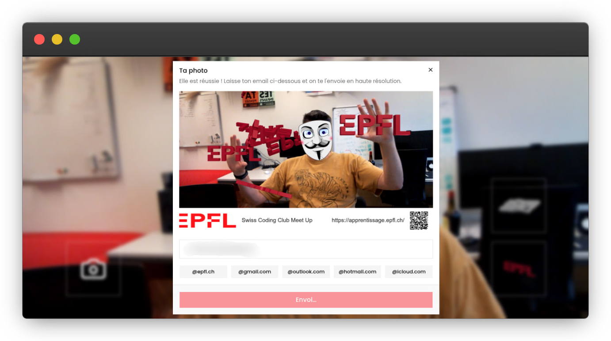

# AR Game

An augmented-reality web experience built by an EPFL IT Apprentice. The app
uses your webcam and real-time hand tracking to overlay 3D EPFL models on the
camera feed. Once you are happy with your pose, capture a photo and receive it
by e-mail.

Live at **[ar.fsd.epfl.ch][live]**.



## Features

- Real-time hand tracking powered by MediaPipe
- 3D AR overlay rendered with Three.js (EPFL logo, Rolex Learning Center)
- Pinch gesture to select and place models
- Photo capture with a countdown timer (gesture or `P` key)
- EPFL-branded photo frame applied automatically
- E-mail delivery of the captured photo

## Tech stack

- [Next.js][nextjs] 16 / React 19
- [Three.js][three] for 3D rendering
- [MediaPipe][mediapipe] for hand-landmark detection
- [Tailwind CSS][tailwind] v4 + [shadcn/ui][shadcn] components
- [Nodemailer][nodemailer] for e-mail delivery
- [Biome][biome] for linting and formatting
- [Bun][bun] as the package manager

## Getting started

**Prerequisites:** [Bun][bun] >= 1.3

```bash
bun install
```

Copy the example environment file and fill in the values:

```bash
cp .env.example .env
```

| Variable        | Description                    |
| --------------- | ------------------------------ |
| `APP_URL`       | Public URL of the app          |
| `MAIL_USERNAME` | SMTP username for Nodemailer   |
| `MAIL_PASSWORD` | SMTP password for Nodemailer   |

Start the development server:

```bash
bun dev
```

Open [http://localhost:3000](http://localhost:3000) in your browser. The app
requires camera permission to run.

### Keyboard shortcuts (development)

| Key | Action                  |
| --- | ----------------------- |
| `P` | Trigger photo countdown |
| `F` | Toggle finger HUD       |

## Build

```bash
bun run build
bun start
```

## Docker

```bash
docker build -t ar-game-2 .
docker run -p 3000:3000 \
  -e APP_URL=http://localhost:3000 \
  -e MAIL_USERNAME=user \
  -e MAIL_PASSWORD=secret \
  ar-game-2
```

## Deployment

The app is deployed on EPFL's OpenShift cluster. Secrets are synchronised
from a local `.env` file and the manifests are applied with:

```bash
./deploy.sh
```

The Kubernetes manifests live in `deploy.yaml`.

[live]: https://ar.fsd.epfl.ch
[nextjs]: https://nextjs.org
[three]: https://threejs.org
[mediapipe]: https://ai.google.dev/edge/mediapipe/solutions/vision/hand_landmarker
[tailwind]: https://tailwindcss.com
[shadcn]: https://ui.shadcn.com
[nodemailer]: https://nodemailer.com
[biome]: https://biomejs.dev
[bun]: https://bun.sh
